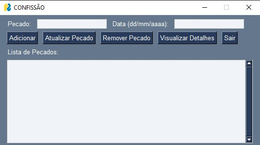

# 🛐 Gerenciador De Pecados

    

**Status:** ✅ Em Desenvolvimento  

Esse projeto desenvolvido com **Python** e **PySimpleGUI**, com o objetivo de fornecer uma interface simples e eficiente para o registro e controle dos pecados cometidos. A plataforma permite ao usuário se autenticar, registrar pecados, acompanhar o histórico e visualizá-los de forma organizada.

## 🔧 Tecnologias Utilizadas

- **Python**: Linguagem principal para desenvolvimento do sistema.
- **PySimpleGUI**: Biblioteca para construção da interface gráfica.
- **JSON**: Armazenamento de dados de usuários e pecados em arquivos JSON.
- **Hashlib**: Utilizado para garantir a segurança no armazenamento de senhas dos usuários.

## 📌 Funcionalidades Atuais

✔️ **Tela de Login**: Autenticação de usuários com validação de senha.  
✔️ **Criação de Usuário**: Permite criar novos usuários, com validação de senha e confirmação de senha.  
✔️ **Registro de Pecados**: Adiciona, atualiza e remove pecados, registrando a data e o histórico de cada um.  
✔️ **Exibição de Dias sem Pecar**: Mostra quantos dias se passaram desde o último pecado cometido.  
✔️ **Visualização de Detalhes**: Exibe os detalhes de um pecado, incluindo a data e o histórico de registros.  
✔️ **Armazenamento Local**: Utiliza arquivos JSON para armazenar os dados dos usuários e pecados de forma persistente.  

## 🚀 Funcionalidades em Desenvolvimento

🔹 **Notificações e Lembretes**: Adição de alertas para incentivar a confissão.  
🔹 **Melhorias na Interface**: Aperfeiçoamento da usabilidade e design visual.  
🔹 **Backup de Dados**: Implementação de sistema de backup para segurança dos dados.  
🔹 **Listagem por Data**: Funcionalidade para exibir pecados em ordem cronológica.  
🔹 **Segurança Aprimorada**: Fortalecimento da segurança na autenticação e no armazenamento de dados.

